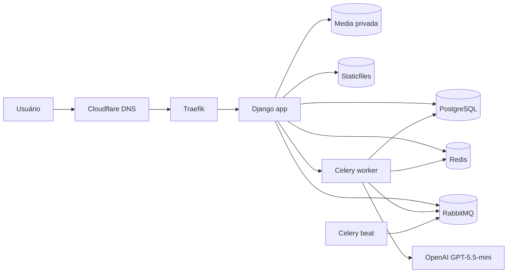
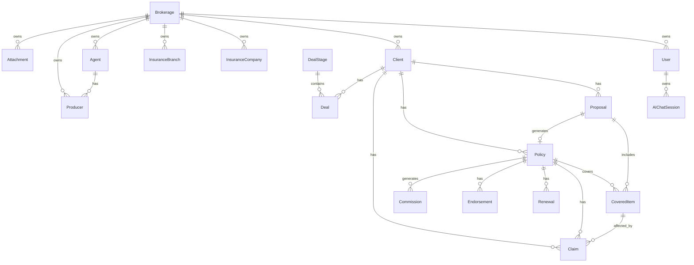

# PRD — SCSI: Sistema de Gestão para Corretora de Seguros Inteligente

## 1. Visão Geral

O SCSI é um SaaS B2B multi-tenant para corretoras de seguros, disponível em `scsi.digital`, desenvolvido com Python, Django, PostgreSQL, Celery, RabbitMQ, Redis, LangChain, LangGraph e recursos de Inteligência Artificial Assistida.

O sistema centraliza a operação comercial, administrativa e gerencial de corretoras: clientes, seguradoras, ramos, propostas, apólices, sinistros, renovações, endossos, CRM, anexos privados, agentes, produtores, comissões, relatórios, dashboards e IA.

A arquitetura deve ser multi-tenant compartilhada, com uma única base PostgreSQL e isolamento lógico por corretora. Dados, arquivos, permissões, relatórios, tarefas assíncronas, cache e agents de IA devem sempre respeitar o tenant do usuário autenticado.

Decisões mandatórias:

| Tema | Decisão |
|---|---|
| Domínio principal | `scsi.digital` |
| Código | Inglês |
| Interface | Português brasileiro |
| Timezone | `America/Sao_Paulo` |
| Arquitetura tenant | Banco compartilhado com isolamento lógico |
| Projeto Django principal | `core` |
| App compartilhada | `base` |
| Settings | Apenas um arquivo `settings.py` |
| Deploy produção | Docker Swarm em VPS Ubuntu |
| Registry | `ghcr.io/pycodebr/scsi_v1` |
| Testes automatizados | Fora do escopo inicial |

## 2. Objetivos do Produto

| ID | Objetivo |
|---|---|
| OBJ-001 | Permitir que corretoras gerenciem toda a carteira de seguros em uma única plataforma. |
| OBJ-002 | Reduzir trabalho manual em propostas, apólices, sinistros, renovações, CRM e comissões. |
| OBJ-003 | Garantir isolamento seguro entre corretoras em ambiente SaaS multi-tenant compartilhado. |
| OBJ-004 | Disponibilizar CRM com grid e Kanban personalizável para acompanhamento comercial. |
| OBJ-005 | Oferecer dashboards e relatórios gerenciais em PDF e CSV. |
| OBJ-006 | Usar IA assistida para resumir entidades e responder perguntas com base nos dados autorizados da corretora. |
| OBJ-007 | Suportar deploy resiliente em VPS Ubuntu com Docker Swarm, Traefik, Cloudflare DNS e TLS wildcard. |
| OBJ-008 | Manter base técnica simples, legível, segura e evolutiva. |

## 3. Público-Alvo

| Público | Necessidade |
|---|---|
| Pequenas e médias corretoras de seguros | Centralizar clientes, propostas, apólices, sinistros, renovações e comissões. |
| Donos de corretoras | Acompanhar carteira, receita, produção, repasses e desempenho comercial. |
| Gerentes comerciais | Gerenciar pipeline, agentes, produtores, metas, renovações e sinistros. |
| Corretores e produtores | Registrar clientes, acompanhar negociações, propostas e apólices. |
| Equipe administrativa | Controlar anexos, relatórios, seguradoras, ramos, endossos e repasses. |

## 4. Problemas que o Sistema Resolve

| ID | Problema | Solução |
|---|---|---|
| PROB-001 | Dados espalhados em planilhas e sistemas isolados. | Cadastro centralizado das entidades do negócio. |
| PROB-002 | Falta de visão clara da carteira e vencimentos. | Dashboard, relatórios e gestão de renovações. |
| PROB-003 | Controle manual de comissões e repasses. | Motor de comissões para corretora, agentes e produtores. |
| PROB-004 | Baixa rastreabilidade de negociações. | CRM com grid, Kanban, etapas customizáveis e histórico. |
| PROB-005 | Risco de acesso indevido entre corretoras. | Multi-tenancy com filtros, permissões, validações server-side e arquivos privados. |
| PROB-006 | Análise manual de clientes, sinistros e apólices. | Resumos assíncronos por IA e chat com agente. |
| PROB-007 | Deploy frágil em VPS. | Docker Swarm com healthchecks, secrets, rollback e TLS wildcard. |

## 5. Escopo do Produto

| Área | Escopo |
|---|---|
| Autenticação | Login por email, logout, recuperação de senha e usuários vinculados a corretoras. |
| Corretoras | Cadastro com CNPJ, Razão Social, dados opcionais e plano inicial `free`. |
| Multi-tenant | Isolamento lógico por corretora em models, views, admin, Celery, arquivos, IA, relatórios e cache. |
| Landing page | Página pública em `scsi.digital`, apresentação do produto, login, cadastro e planos fictícios. |
| Entidades | Clientes, seguradoras, ramos, propostas, apólices, sinistros, anexos, renovações, coberturas, itens cobertos, agentes, produtores, comissões, endossos e negociações CRM. |
| CRM | Grid, Kanban, etapas customizáveis, cores customizáveis e cards arrastáveis. |
| IA | Resumos de cliente, apólice, sinistro, proposta e negociação; chat com sessões salvas por usuário. |
| Async | Celery com RabbitMQ como broker e Redis como result backend/cache. |
| Relatórios | Tela dedicada, exportação PDF com ReportLab/PyPDF e CSV. |
| Dashboard | KPIs, gráficos, funil de negociações/leads e insights. |
| Admin | Django admin com filtros, buscas e respeito a tenant/permissões. |
| Documentação | Pasta `docs/`, MKDocs e Mermaid. |
| Dados fake | Command Django para carga realista multi-cenário. |
| Deploy | Docker Compose local e Docker Swarm em VPS Ubuntu com Traefik, Cloudflare e GHCR. |

## 6. Fora de Escopo Inicial

| Item | Decisão |
|---|---|
| Pagamentos reais | Não implementar integração de pagamentos. |
| Planos pagos ativos | Apenas plano `free` habilitado; demais planos aparecem como “em breve”. |
| App mobile nativo | Apenas web responsivo. |
| Schemas por tenant | Não usar schemas separados. |
| Bancos por tenant | Não usar bancos separados. |
| Testes automatizados | Não implementar no escopo inicial. |
| Integrações externas não solicitadas | Não integrar CRMs externos, ERPs, WhatsApp, bancos, gateways ou seguradoras via API. |
| OCR | Fora do escopo inicial. |
| Assinatura digital | Fora do escopo inicial. |

## 7. Personas e Perfis de Usuário

| Perfil | Descrição | Permissões principais |
|---|---|---|
| `brokerage_owner` | Dono da corretora. | Acesso total aos dados da própria corretora, usuários, permissões, relatórios e comissões. |
| `brokerage_admin` | Administrador operacional. | Gestão ampla da corretora, exceto configurações sensíveis restritas ao dono. |
| `manager` | Gerente comercial ou operacional. | Gestão de carteira, CRM, propostas, apólices, sinistros, renovações, agentes e produtores conforme permissões. |
| `agent` | Agente parceiro ou vendedor associado. | Acesso aos dados atribuídos a si e aos produtores vinculados. |
| `producer` | Corretor final/produtor. | Acesso a clientes, negociações, propostas e apólices atribuídas a si. |
| `staff` | Equipe administrativa. | Acesso operacional definido por grupos e permissões do Django. |
| `superuser` | Administrador técnico da plataforma. | Acesso administrativo técnico auditável, sem burlar tenant em telas de negócio. |

Regras:

| ID | Regra |
|---|---|
| PERM-001 | Todo usuário comum deve estar vinculado a exatamente uma corretora ativa. |
| PERM-002 | `superuser` pode acessar admin técnico, mas telas de negócio devem aplicar escopo explícito. |
| PERM-003 | Grupos e permissões devem usar o sistema nativo do Django sempre que possível. |
| PERM-004 | Operações sensíveis devem validar tenant no servidor. |

## 8. Visão Funcional do Sistema

| Módulo | Função |
|---|---|
| Landing | Apresentar produto, planos e entrada para cadastro/login. |
| Conta e autenticação | Cadastro inicial, login por email, recuperação de senha e usuários. |
| Corretora | Dados cadastrais, plano, configurações e usuários vinculados. |
| Clientes | Cadastro, histórico, documentos, propostas, apólices, sinistros e resumo com IA. |
| Seguradoras e ramos | Cadastros de referência por corretora. |
| Propostas | Cotação comercial, itens cobertos, status e geração de apólice. |
| Apólices | Gestão do contrato emitido, coberturas, vigência, anexos e resumo com IA. |
| Itens cobertos | Objetos segurados vinculados a propostas e apólices. |
| Sinistros | Ocorrências vinculadas a apólice e item coberto. |
| Renovações | Controle de vencimentos, status, alertas e relatórios. |
| Endossos | Alterações vinculadas a apólices. |
| CRM | Negociações, pipeline, etapas e Kanban. |
| Comissões | Cálculo de comissão da corretora, agentes e produtores. |
| IA | Resumos assíncronos e chat com agente. |
| Relatórios | Relatórios em tela, PDF e CSV. |
| Dashboard | Métricas, gráficos, funil e insights. |
| Admin | Gestão técnica e operacional via Django admin. |

## 9. Requisitos Funcionais

| ID | Requisito |
|---|---|
| FR-001 | O sistema deve permitir cadastro de conta com criação da corretora, CNPJ obrigatório, Razão Social obrigatória e seleção de plano. |
| FR-002 | Apenas o plano `free` deve estar habilitado inicialmente. |
| FR-003 | A landing page deve exibir planos fictícios, com botões pagos desabilitados e texto “em breve”. |
| FR-004 | O login deve usar email como identificador principal. |
| FR-005 | Recuperação de senha deve usar recursos nativos do Django e envio de email configurado por `.env`. |
| FR-006 | Todo usuário comum deve estar associado a uma corretora. |
| FR-007 | O sistema deve permitir CRUD de clientes. |
| FR-008 | Cliente deve possuir propostas, apólices, sinistros, anexos e negociações. |
| FR-009 | O sistema deve permitir CRUD de seguradoras. |
| FR-010 | O sistema deve permitir CRUD de ramos de seguro. |
| FR-011 | O sistema deve permitir CRUD de propostas. |
| FR-012 | Proposta deve poder conter múltiplos itens cobertos. |
| FR-013 | Proposta deve ter botão “gerar apólice”. |
| FR-014 | O botão “gerar apólice” deve criar apólice baseada nos dados da proposta. |
| FR-015 | O sistema deve permitir CRUD de apólices. |
| FR-016 | Apólice deve poder conter múltiplos itens cobertos. |
| FR-017 | O sistema deve permitir CRUD de itens cobertos. |
| FR-018 | Item coberto deve representar o objeto segurado. |
| FR-019 | Sinistro deve estar sempre vinculado a uma apólice. |
| FR-020 | Sinistro deve estar sempre vinculado a um item coberto pertencente à apólice. |
| FR-021 | O sistema deve permitir anexos em clientes, propostas, apólices e sinistros. |
| FR-022 | Arquivos anexados devem ser privados. |
| FR-023 | O sistema deve permitir CRUD de renovações. |
| FR-024 | Renovações devem controlar vencimento, status, alertas e relatórios. |
| FR-025 | O sistema deve permitir CRUD de endossos vinculados a apólices. |
| FR-026 | O sistema deve permitir CRUD de agentes. |
| FR-027 | O sistema deve permitir CRUD de produtores. |
| FR-028 | Produtor pode estar vinculado a agente ou diretamente à corretora. |
| FR-029 | O sistema deve calcular comissão da corretora e repasses para agentes e produtores. |
| FR-030 | O sistema deve gerar relatórios de comissões e repasses. |
| FR-031 | O CRM deve ter visualização em grid. |
| FR-032 | O CRM deve ter visualização em Kanban. |
| FR-033 | Pipeline Kanban deve permitir etapas com nome e cor customizáveis. |
| FR-034 | Cards do Kanban devem ser arrastáveis entre etapas. |
| FR-035 | O dashboard deve exibir métricas, gráficos, insights e funil de negociações/leads. |
| FR-036 | Relatórios devem possuir tela e menu dedicados. |
| FR-037 | Relatórios devem exportar PDF e CSV. |
| FR-038 | Entidades cliente, apólice, sinistro, proposta e negociação devem ter botão “resumir com IA”. |
| FR-039 | Resumo com IA deve ser processado em Celery sem bloquear a interface. |
| FR-040 | Resultado do resumo com IA deve ser salvo em campo de texto da entidade. |
| FR-041 | O usuário deve ver loading no botão e mensagem de que será notificado quando a análise ficar pronta. |
| FR-042 | Ao finalizar task de IA, o usuário deve receber notificação interna. |
| FR-043 | Deve existir tela de Chat com agente de IA no menu lateral. |
| FR-044 | Chat de IA deve permitir sessões salvas por usuário. |
| FR-045 | Chat de IA deve responder com efeito stream. |
| FR-046 | Respostas de IA devem ser em Markdown e renderizadas com segurança para HTML. |
| FR-047 | O Django admin deve permitir gestão de todas as entidades com filtros e buscas. |
| FR-048 | Deve existir command Django para carga de dados fake realistas. |
| FR-049 | Deve existir documentação em `docs/` servida por MKDocs com Mermaid. |
| FR-050 | Todas as tabelas/models devem possuir `created_at` e `updated_at`. |

## 10. Requisitos Não Funcionais

| ID | Requisito |
|---|---|
| NFR-001 | Usar Python > 3.13. |
| NFR-002 | Usar Django > 6.0. |
| NFR-003 | Usar LangChain > 1.0. |
| NFR-004 | Usar OpenAI com modelo padrão `GPT-5.5-mini`. |
| NFR-005 | Usar PostgreSQL como banco principal. |
| NFR-006 | Usar Celery para tarefas pesadas. |
| NFR-007 | Usar RabbitMQ como broker do Celery. |
| NFR-008 | Usar Redis como result backend do Celery e cache. |
| NFR-009 | Usar timezone `America/Sao_Paulo`. |
| NFR-010 | Existir apenas um arquivo `settings.py`. |
| NFR-011 | Configurações devem vir de `.env` via `django-environ`. |
| NFR-012 | `.env` deve ser gitignored. |
| NFR-013 | `.env` de produção deve ser separado do `.env` de desenvolvimento. |
| NFR-014 | Código do projeto deve ser em inglês. |
| NFR-015 | Interface deve ser em português brasileiro. |
| NFR-016 | Código deve ser simples, legível, PEP8 e usar aspas simples. |
| NFR-017 | Usar recursos nativos do Django sempre que possível. |
| NFR-018 | Usar Class Based Views sempre que possível. |
| NFR-019 | A aplicação deve ser responsiva em diferentes tamanhos de tela. |
| NFR-020 | Nada pesado deve bloquear request/response. |
| NFR-021 | Produção deve rodar em Docker Swarm em VPS Ubuntu. |
| NFR-022 | Traefik deve ser web server/load balancer. |
| NFR-023 | TLS deve usar Let’s Encrypt wildcard via DNS-01 com Cloudflare. |
| NFR-024 | Deploy deve usar imagem em `GHCR` no registry `ghcr.io/pycodebr/scsi_v1`. |
| NFR-025 | Serviços devem ter healthchecks, restart policies, resource limits e reservations. |
| NFR-026 | App deve atualizar sem downtime com rollback automático em falha. |
| NFR-027 | Migrations devem usar advisory lock do PostgreSQL. |
| NFR-028 | `collectstatic` deve rodar com `--clear`. |
| NFR-029 | Serviços Celery não devem rodar migrations nem `collectstatic`. |
| NFR-030 | `/health/` deve retornar HTTP 200 sem acessar banco e sem autenticação. |
| NFR-031 | Não implementar testes automatizados no escopo inicial. |

## 11. Arquitetura Técnica

Stack obrigatória:

| Camada | Tecnologia |
|---|---|
| Linguagem | Python > 3.13 |
| Framework | Django > 6.0 |
| Banco | PostgreSQL |
| Broker | RabbitMQ |
| Cache/result backend | Redis |
| Tasks | Celery |
| IA | LangChain > 1.0, LangGraph, OpenAI `GPT-5.5-mini` |
| Relatórios | ReportLab, PyPDF, CSV nativo |
| Documentação | MKDocs com Mermaid |
| Desenvolvimento local | Docker Compose |
| Produção | Docker Swarm |
| Proxy/TLS | Traefik, Cloudflare DNS, Let’s Encrypt DNS-01 |
| Registry | `ghcr.io/pycodebr/scsi_v1` |



Decisões:

| Decisão | Justificativa |
|---|---|
| Django monolítico modular | Reduz complexidade operacional e atende ao MVP SaaS. |
| Multi-tenant compartilhado | Simples de operar em VPS e aderente à restrição de não usar schemas/bancos por tenant. |
| Celery para IA | Evita bloquear interface e permite retries/timeouts. |
| RabbitMQ como broker | Adequado para filas de tarefas Celery em produção. |
| Redis como result backend/cache | Atende resultados de tasks, cache e notificações leves. |
| Traefik no Swarm | Facilita roteamento, TLS automático e rollout sem downtime. |

## 12. Arquitetura Multi-Tenant Compartilhada

O SCSI deve usar isolamento lógico por corretora em uma base PostgreSQL compartilhada.

Regras obrigatórias:

| ID | Regra |
|---|---|
| MT-001 | Não usar schemas separados por tenant. |
| MT-002 | Não usar bancos separados por tenant. |
| MT-003 | Toda entidade de negócio deve ter vínculo direto ou indireto com `Brokerage`. |
| MT-004 | Queries sensíveis devem filtrar pela corretora atual. |
| MT-005 | Views, forms, CBVs, admin, tasks Celery, exports, cache e tools de IA devem receber escopo de tenant. |
| MT-006 | Nenhum usuário comum pode consultar, listar, exportar, baixar ou inferir dados de outra corretora. |
| MT-007 | IDs enviados por URL ou formulário devem ser revalidados no servidor contra a corretora do usuário. |
| MT-008 | Cache deve incluir `brokerage_id` na chave quando armazenar dados de negócio. |
| MT-009 | Logs não devem expor dados sensíveis e devem registrar `brokerage_id` quando útil para auditoria. |
| MT-010 | Tasks assíncronas devem receber `brokerage_id` e `user_id`, nunca depender apenas de estado global de request. |

Estratégia:

| Camada | Exigência |
|---|---|
| Model | Campos `brokerage`, `created_at`, `updated_at`; constraints por tenant quando aplicável. |
| Manager/QuerySet | Método `for_brokerage(brokerage)` para filtragem explícita. |
| Middleware | Resolver corretora do usuário autenticado e anexar ao request. |
| CBVs | `get_queryset()` sempre filtra por `request.user.brokerage`. |
| Forms | Choices de FK devem ser filtradas por tenant. |
| Admin | `get_queryset()`, `formfield_for_foreignkey()` e permissões devem respeitar tenant. |
| Celery | Tasks recebem `brokerage_id`, carregam objetos pelo tenant e rejeitam inconsistências. |
| IA | Tools sempre recebem escopo de tenant e não executam queries globais. |
| Arquivos | Download apenas por view segura com validação de tenant e permissão. |

## 13. Segurança, Permissões e Isolamento de Dados

| ID | Regra |
|---|---|
| SEC-001 | Todas as rotas internas devem exigir autenticação, exceto landing, cadastro, login, recuperação de senha e `/health/`. |
| SEC-002 | Operações de leitura e escrita devem validar tenant no backend. |
| SEC-003 | Permissões devem usar grupos/permissões nativas do Django sempre que possível. |
| SEC-004 | Dados sensíveis não devem aparecer em logs, mensagens de erro ou HTML público. |
| SEC-005 | `.env` e segredos nunca devem ser versionados. |
| SEC-006 | Produção deve usar `DEBUG=False`. |
| SEC-007 | `ALLOWED_HOSTS` e `CSRF_TRUSTED_ORIGINS` devem vir do `.env` como listas via `django-environ`. |
| SEC-008 | `SECURE_PROXY_SSL_HEADER=('HTTP_X_FORWARDED_PROTO','https')` deve ser configurado em produção. |
| SEC-009 | `/health/` deve ser isento de redirect HTTPS via `SECURE_REDIRECT_EXEMPT`. |
| SEC-010 | Templates que renderizam Markdown da IA devem sanitizar HTML. |
| SEC-011 | Arquivos privados não podem ser servidos diretamente como arquivos públicos. |
| SEC-012 | Sessões e cookies devem usar configurações seguras em produção. |

Configuração de produção:

```env
ALLOWED_HOSTS=scsi.digital,.scsi.digital,localhost,127.0.0.1
CSRF_TRUSTED_ORIGINS=https://scsi.digital,https://*.scsi.digital
```

## 14. Proteção de Arquivos e Media Privada

Arquivos privados devem ser armazenados em volume persistente `media`, mas nunca servidos por rota pública direta.

| ID | Regra |
|---|---|
| MEDIA-001 | Anexos devem existir para clientes, propostas, apólices e sinistros. |
| MEDIA-002 | Todo anexo deve pertencer a uma corretora. |
| MEDIA-003 | Download deve ocorrer via view segura autenticada. |
| MEDIA-004 | A view de download deve validar usuário, corretora, permissão e vínculo do arquivo à entidade. |
| MEDIA-005 | URLs de media não devem expor caminho absoluto do filesystem. |
| MEDIA-006 | Arquivos devem aceitar diversos formatos, com validação de tamanho e extensão configurável. |
| MEDIA-007 | Upload deve registrar autor, data, entidade vinculada e metadados básicos. |
| MEDIA-008 | O Traefik não deve expor diretório de media diretamente. |

## 15. Apps Django Recomendados

| App | Responsabilidade |
|---|---|
| `core` | URLs globais, WSGI/ASGI, settings e healthcheck. |
| `base` | Mixins, managers, campos compartilhados, permissões comuns, helpers e templates base. |
| `accounts` | Custom user com login por email, perfis, grupos e autenticação. |
| `brokerages` | Corretoras, planos fictícios, configurações e cadastro inicial. |
| `clients` | Clientes, contatos, visão 360 e resumo com IA. |
| `insurers` | Seguradoras. |
| `branches` | Ramos de seguro. |
| `covered_items` | Itens cobertos e objetos segurados. |
| `proposals` | Propostas, status, itens e geração de apólice. |
| `policies` | Apólices, coberturas, vigências e vínculo com proposta. |
| `claims` | Sinistros, status, anexos e resumo com IA. |
| `attachments` | Upload, armazenamento e download seguro. |
| `renewals` | Renovações, vencimentos, status e alertas. |
| `endorsements` | Endossos vinculados a apólices. |
| `crm` | Negociações, pipeline, etapas e Kanban. |
| `commissions` | Regras, cálculos, repasses e relatórios. |
| `reports` | Relatórios, PDF, CSV e consultas gerenciais. |
| `dashboard` | Métricas, gráficos, insights e funil. |
| `ai_agents` | LangChain, LangGraph, tools, resumos e chat. |
| `notifications` | Notificações internas para tasks assíncronas. |

Signals devem ficar em `signals.py` dentro da app correspondente, ser idempotentes e não executar processamento pesado.

## 16. Modelagem Inicial de Domínio



Modelos mínimos:

| Model | Campos essenciais |
|---|---|
| `Brokerage` | `name`, `legal_name`, `cnpj`, `plan`, `is_active`, `created_at`, `updated_at`. |
| `User` | `email`, `first_name`, `last_name`, `brokerage`, `is_active`, `is_staff`, `created_at`, `updated_at`. |
| `Client` | `brokerage`, `name`, `document`, `email`, `phone`, `type`, `notes`, `ai_summary`, `created_at`, `updated_at`. |
| `InsuranceCompany` | `brokerage`, `name`, `cnpj`, `contact_email`, `contact_phone`, `created_at`, `updated_at`. |
| `InsuranceBranch` | `brokerage`, `name`, `description`, `created_at`, `updated_at`. |
| `Proposal` | `brokerage`, `client`, `insurance_company`, `branch`, `status`, `premium_amount`, `commission_rate`, `valid_until`, `ai_summary`, `created_at`, `updated_at`. |
| `Policy` | `brokerage`, `proposal`, `client`, `insurance_company`, `branch`, `policy_number`, `start_date`, `end_date`, `premium_amount`, `status`, `ai_summary`, `created_at`, `updated_at`. |
| `CoveredItem` | `brokerage`, `proposal`, `policy`, `item_type`, `description`, `insured_value`, `metadata`, `created_at`, `updated_at`. |
| `Coverage` | `brokerage`, `proposal`, `policy`, `name`, `limit_amount`, `deductible_amount`, `created_at`, `updated_at`. |
| `Claim` | `brokerage`, `client`, `policy`, `covered_item`, `claim_number`, `status`, `occurred_at`, `description`, `ai_summary`, `created_at`, `updated_at`. |
| `Renewal` | `brokerage`, `policy`, `due_date`, `status`, `notes`, `created_at`, `updated_at`. |
| `Endorsement` | `brokerage`, `policy`, `endorsement_number`, `type`, `description`, `effective_date`, `created_at`, `updated_at`. |
| `Agent` | `brokerage`, `name`, `document`, `type`, `commission_rate`, `created_at`, `updated_at`. |
| `Producer` | `brokerage`, `agent`, `name`, `document`, `commission_rate`, `created_at`, `updated_at`. |
| `Commission` | `brokerage`, `policy`, `agent`, `producer`, `gross_amount`, `brokerage_amount`, `agent_amount`, `producer_amount`, `status`, `created_at`, `updated_at`. |
| `DealStage` | `brokerage`, `name`, `color`, `position`, `created_at`, `updated_at`. |
| `Deal` | `brokerage`, `client`, `stage`, `title`, `estimated_value`, `status`, `assigned_to`, `ai_summary`, `created_at`, `updated_at`. |
| `Attachment` | `brokerage`, `uploaded_by`, `file`, `original_name`, `content_type`, `size_bytes`, vínculos opcionais, `created_at`, `updated_at`. |
| `Notification` | `brokerage`, `user`, `title`, `message`, `level`, `is_read`, `created_at`, `updated_at`. |
| `AIChatSession` | `brokerage`, `user`, `title`, `created_at`, `updated_at`. |
| `AIChatMessage` | `brokerage`, `session`, `role`, `content_markdown`, `created_at`, `updated_at`. |

Constraints e índices:

| Regra |
|---|
| `Brokerage.cnpj` deve ser único. |
| `User.email` deve ser único. |
| Números de apólice devem ser únicos por corretora e seguradora quando aplicável. |
| `DealStage.position` deve ser ordenável por corretora. |
| FKs sensíveis devem ter índice. |
| Campos de filtro frequente devem ser indexados: `brokerage`, `status`, `created_at`, `end_date`, `due_date`, `assigned_to`. |

## 17. Fluxos Principais do Sistema

Cadastro de conta:

| Passo | Comportamento |
|---|---|
| 1 | Usuário acessa landing em `scsi.digital`. |
| 2 | Usuário clica no plano `free`. |
| 3 | Sistema abre cadastro com dados do usuário e da corretora. |
| 4 | Usuário informa email, senha, CNPJ e Razão Social. |
| 5 | Sistema cria `Brokerage`, usuário dono e sessão autenticada. |
| 6 | Sistema redireciona para dashboard inicial. |

Geração de apólice:

| Passo | Comportamento |
|---|---|
| 1 | Usuário acessa proposta da própria corretora. |
| 2 | Usuário clica em “gerar apólice”. |
| 3 | Sistema valida permissões, tenant e status da proposta. |
| 4 | Sistema cria apólice com cliente, seguradora, ramo, valores, coberturas e itens cobertos derivados da proposta. |
| 5 | Sistema marca proposta como `converted` ou vinculada à apólice. |
| 6 | Sistema exibe apólice criada. |

Resumo com IA:

| Passo | Comportamento |
|---|---|
| 1 | Usuário clica em “resumir com IA”. |
| 2 | Interface mostra loading e mensagem de processamento assíncrono. |
| 3 | View valida tenant e permissão. |
| 4 | Task Celery recebe `brokerage_id`, `user_id`, `entity_type` e `entity_id`. |
| 5 | Agent tool consulta apenas dados da corretora. |
| 6 | IA gera Markdown com resumo e insights. |
| 7 | Sistema salva resumo na entidade. |
| 8 | Sistema cria notificação interna para o usuário. |

Chat com IA:

| Passo | Comportamento |
|---|---|
| 1 | Usuário abre “Chat com IA”. |
| 2 | Usuário cria ou seleciona sessão. |
| 3 | Usuário envia pergunta. |
| 4 | Sistema salva mensagem do usuário. |
| 5 | Agente consulta tools filtradas por tenant. |
| 6 | Resposta é transmitida com efeito stream. |
| 7 | Resposta Markdown é salva e renderizada com segurança. |

## 18. Dashboard e Métricas

Métricas mínimas:

| Categoria | Métricas |
|---|---|
| Clientes | Total de clientes, novos clientes no período, clientes ativos. |
| Seguros | Total de propostas, apólices ativas, apólices vencidas, apólices a vencer. |
| Seguradoras | Distribuição por seguradora, ranking por prêmio, ranking por quantidade. |
| Valores | Prêmios emitidos, comissões previstas, comissões recebidas, repasses pendentes. |
| Sinistros | Sinistros abertos, encerrados, por status e por ramo. |
| Renovações | Renovações vencendo em 30, 60 e 90 dias. |
| CRM | Negociações por etapa, valor estimado por etapa e funil de conversão. |
| IA | Quantidade de resumos gerados e sessões de chat recentes. |

Gráficos obrigatórios: funil de negociações/leads, série temporal, pizza/rosca, barras e cards KPI.

Regras: todas as métricas devem filtrar pela corretora atual, evitar queries N+1, usar agregações otimizadas ou cache por tenant e respeitar `@design_system/design-system.html`.

## 19. CRM, Pipeline e Kanban

| Entidade | Função |
|---|---|
| `Deal` | Representa negociação, oportunidade ou lead. |
| `DealStage` | Etapa personalizável do pipeline. |
| `Client` | Cliente ou prospect relacionado. |
| `User` | Responsável pela negociação. |

Requisitos:

| ID | Requisito |
|---|---|
| CRM-001 | Deve existir visualização em grid com filtros e busca. |
| CRM-002 | Deve existir visualização Kanban. |
| CRM-003 | Etapas devem ter nome personalizável. |
| CRM-004 | Etapas devem ter cor personalizável. |
| CRM-005 | Etapas devem ter ordenação por `position`. |
| CRM-006 | Cards devem ser arrastáveis entre etapas. |
| CRM-007 | Mudança de etapa deve validar tenant, permissão e integridade da etapa. |
| CRM-008 | Negociação deve permitir resumo com IA. |
| CRM-009 | Grid e Kanban devem exibir apenas negociações da corretora atual. |
| CRM-010 | Deve haver filtros por responsável, cliente, etapa, status, valor e data. |

Estados sugeridos: `open`, `won`, `lost`, `archived`.

## 20. Propostas, Apólices, Itens Cobertos e Sinistros

Propostas devem pertencer a uma corretora e a um cliente, podem ter seguradora, ramo, múltiplos itens cobertos, coberturas e resumo com IA. Uma proposta pode gerar uma apólice uma única vez, salvo regra futura de duplicação controlada.

Apólices devem pertencer a uma corretora e cliente, podem ser criadas manualmente ou a partir de proposta, devem possuir vigência, status, valores, número identificador, itens cobertos, coberturas e resumo com IA.

Tipos de item coberto: `vehicle`, `property`, `life`, `travel`, `business`, `other`.

Sinistros devem estar vinculados a uma apólice e a um item coberto da mesma apólice, devem permitir anexos e resumo com IA. O sistema deve impedir sinistro para item coberto que não pertence à apólice informada.

Estados sugeridos:

| Entidade | Estados |
|---|---|
| Proposta | `draft`, `sent`, `approved`, `rejected`, `converted`, `expired`. |
| Apólice | `active`, `expired`, `cancelled`, `pending`. |
| Sinistro | `reported`, `under_review`, `approved`, `rejected`, `paid`, `closed`. |
| Renovação | `pending`, `in_progress`, `renewed`, `lost`, `expired`. |

## 21. Agentes, Produtores e Comissões

| Nível | Descrição |
|---|---|
| Corretora | Recebe a comissão principal. |
| Agente | Pessoa ou empresa parceira que vende seguros para a corretora. |
| Produtor | Corretor final, podendo trabalhar para agente ou diretamente para corretora. |

Regras:

| ID | Regra |
|---|---|
| COMM-001 | Uma corretora pode ter vários agentes. |
| COMM-002 | Um agente pode ter vários produtores. |
| COMM-003 | Produtor pode estar vinculado a agente ou diretamente à corretora. |
| COMM-004 | Comissão é paga para a corretora. |
| COMM-005 | Corretora repassa parte da comissão para agentes e produtores. |
| COMM-006 | Sistema deve calcular comissão bruta, valor da corretora, valor do agente e valor do produtor. |
| COMM-007 | Regras de comissão devem respeitar percentuais configurados por entidade e política da corretora. |
| COMM-008 | Relatórios devem exibir comissões por período, status, agente, produtor, apólice, seguradora e ramo. |

Estados: `expected`, `received`, `partially_paid`, `paid`, `cancelled`.

Fórmula base: `brokerage_amount = gross_amount - agent_amount - producer_amount`.

## 22. Inteligência Artificial no Sistema

| Item | Decisão |
|---|---|
| Framework | LangChain > 1.0 e LangGraph. |
| Modelo | OpenAI `GPT-5.5-mini`. |
| Execução | Celery para resumos e processamento pesado. |
| Chat | Streaming na interface, sessões salvas por usuário. |
| Formato | Resposta em Markdown. |
| Renderização | Markdown para HTML com sanitização segura. |

Recursos:

| Recurso | Entidade | Persistência |
|---|---|---|
| Resumir cliente | `Client` | `ai_summary`. |
| Resumir apólice | `Policy` | `ai_summary`. |
| Resumir sinistro | `Claim` | `ai_summary`. |
| Resumir proposta | `Proposal` | `ai_summary`. |
| Resumir negociação | `Deal` | `ai_summary`. |
| Chat com agente | `AIChatSession` e `AIChatMessage` | Histórico por usuário. |

Regras de tools:

| ID | Regra |
|---|---|
| AI-001 | Toda tool deve receber `brokerage_id`. |
| AI-002 | Toda consulta feita por tool deve filtrar pela corretora. |
| AI-003 | Tool não pode aceitar SQL livre do modelo. |
| AI-004 | Tool deve expor operações controladas. |
| AI-005 | Prompt deve instruir o agente a responder apenas com base em dados autorizados. |
| AI-006 | Se dados forem insuficientes, IA deve informar limitação sem inventar informação. |
| AI-007 | Conteúdo gerado deve ser salvo como Markdown. |
| AI-008 | Erros de IA devem gerar notificação amigável em português brasileiro. |
| AI-009 | Tasks devem ter timeout, retry limitado e tratamento de falha. |
| AI-010 | Logs de IA não devem armazenar segredos ou dados sensíveis desnecessários. |

## 23. Tarefas Assíncronas, Celery, RabbitMQ e Redis

| Componente | Responsabilidade |
|---|---|
| Celery worker | Processar resumos de IA, tarefas pesadas e rotinas assíncronas. |
| Celery beat | Agendar rotinas recorrentes, como alertas de renovações. |
| RabbitMQ | Broker do Celery. |
| Redis | Result backend do Celery e cache da aplicação. |
| dj-celery-panel | Visualização das tasks no admin do Django. |

Regras: tasks de IA não bloqueiam interface; views enfileiram task e retornam rápido; botões exibem loading; usuário é notificado ao fim; tasks recebem `brokerage_id` e `user_id`; Celery usa entrypoint separado; Celery não roda migrations nem `collectstatic`.

## 24. Relatórios, PDF e CSV

| Formato | Tecnologia |
|---|---|
| PDF | ReportLab e PyPDF. |
| CSV | Biblioteca CSV nativa do Python. |

Relatórios mínimos: clientes, seguros, seguradoras, apólices, propostas, sinistros, renovações, comissões e carteira.

Regras: respeitar tenant e permissões, exportar com filtros da corretora atual, CSV com cabeçalhos em português brasileiro, PDF compatível com design system e relatórios pesados preparados para execução assíncrona quando necessário.

## 25. Landing Page, Cadastro e Planos

A landing page deve estar na raiz em `scsi.digital`, apresentar o SCSI, ter CTA para criar conta e login, exibir planos fictícios, habilitar apenas o plano `free` e manter planos pagos como “em breve”. Não implementar pagamentos reais.

Cadastro deve exigir email, senha, nome, CNPJ, Razão Social e plano `free`. Dados adicionais da corretora são opcionais.

## 26. Admin Django

| ID | Regra |
|---|---|
| ADMIN-001 | Todas as entidades principais devem estar registradas no admin. |
| ADMIN-002 | Admin deve possuir filtros úteis por status, data, corretora e relacionamentos. |
| ADMIN-003 | Admin deve possuir busca por campos textuais relevantes. |
| ADMIN-004 | Admin deve respeitar tenant quando usado por staff de corretora. |
| ADMIN-005 | Superuser técnico deve ser usado com cautela e rastreabilidade. |
| ADMIN-006 | `dj-celery-panel` deve estar disponível no admin. |
| ADMIN-007 | FKs nos forms do admin devem ser filtradas por tenant. |

## 27. Design System e UI/UX

O design system obrigatório está referenciado em `@design_system/design-system.html`.

Regras: respeitar cores, componentes e tipografias; interface responsiva; textos em português brasileiro; feedback claro de erro, sucesso e loading; bom contraste; dashboard com KPIs claros; Kanban usável em desktop e mobile; tabelas com busca, filtros, paginação e estados vazios amigáveis.

Menu lateral mínimo: Dashboard, Clientes, CRM, Propostas, Apólices, Sinistros, Renovações, Comissões, Relatórios, Chat com IA e Configurações.

## 28. Documentação com MKDocs

Criar `docs/`, manter documentação atualizada, usar MKDocs com Mermaid e documentar arquitetura, deploy, variáveis, scripts, modelos, fluxos, segurança, IA e regras multi-tenant.

Arquivos recomendados: `docs/PRD.md`, `docs/architecture.md`, `docs/deploy.md`, `docs/multi-tenant.md`, `docs/security.md`, `docs/ai.md`, `docs/operations.md`.

## 29. Dados Fake para Demonstração

Criar command Django para gerar múltiplas corretoras, usuários, clientes, seguradoras, ramos, propostas, apólices, sinistros, renovações, agentes, produtores, comissões e negociações. Dados devem ter datas variadas, cobrir múltiplos cenários, ser identificáveis como demonstração e evitar dados reais sensíveis.

## 30. Estrutura Recomendada de Pastas

```text
scsi_v2/
├── .venv/
├── .env
├── .env.example
├── .gitignore
├── PRD.md
├── requirements.txt
├── manage.py
├── Dockerfile
├── docker-compose.yml
├── docker-stack.yml
├── mkdocs.yml
├── core/
├── base/
├── accounts/
├── brokerages/
├── clients/
├── insurers/
├── branches/
├── covered_items/
├── proposals/
├── policies/
├── claims/
├── attachments/
├── renewals/
├── endorsements/
├── crm/
├── commissions/
├── reports/
├── dashboard/
├── ai_agents/
├── notifications/
├── templates/
├── static/
├── media/
├── docs/
│   ├── PRD.md
│   ├── architecture.md
│   ├── deploy.md
│   ├── multi-tenant.md
│   ├── security.md
│   ├── ai.md
│   └── operations.md
├── scripts/
│   ├── deploy.sh
│   └── backup.sh
└── design_system/
    └── design-system.html
```

## 31. Configuração Local com Docker Compose

Serviços obrigatórios: `app`, `postgresql`, `celery_worker`, `celery_beat`, `rabbitmq`, `redis` e `traefik` quando aplicável.

Regras: usar Docker Compose, ambiente virtual `.venv`, `.env` separado de produção, `env_file` sem shell, scripts com parser seguro de `KEY=VALUE`, nunca usar `source` ou `.` para carregar `.env`.

Comandos esperados:

```bash
python3.13 -m venv .venv
.venv/bin/pip install -r requirements.txt
docker compose up --build
docker compose exec app python manage.py migrate
docker compose exec app python manage.py collectstatic --noinput --clear
docker compose exec app python manage.py createsuperuser
```

## 32. Deploy em Produção com Docker Swarm

| Item | Valor |
|---|---|
| Registry | `GHCR` |
| Imagem | `ghcr.io/pycodebr/scsi_v1` |
| Deploy | `docker stack deploy --with-registry-auth` |

Serviços e redes:

| Serviço | Redes |
|---|---|
| `app` | `traefik_public`, `scsi_v1_internal` |
| `postgresql` | `scsi_v1_internal` |
| `redis` | `scsi_v1_internal` |
| `rabbitmq` | `scsi_v1_internal` |
| `celery_worker` | `scsi_v1_internal`, `scsi_v1_egress` |
| `celery_beat` | `scsi_v1_internal`, `scsi_v1_egress` |
| `traefik` | `traefik_public` |

Redes overlay obrigatórias:

| Rede | Configuração | Uso |
|---|---|---|
| `traefik_public` | external | Entrada HTTP/HTTPS pública para app e Traefik. |
| `scsi_v1_internal` | `internal: true` | Comunicação interna sem internet. |
| `scsi_v1_egress` | overlay sem `internal` | Saída para APIs externas por Celery. |

Regra crítica: nunca colocar `celery_worker` ou `celery_beat` na `traefik_public`.

Volumes nomeados: `postgresql`, `redis`, `rabbitmq`, `media`, `staticfiles`, `letsencrypt`.

## 33. Guia Completo de Deploy em VPS Ubuntu do Zero

Acessar VPS:

```bash
ssh root@<VPS_IP>
```

Atualizar Ubuntu:

```bash
apt update
apt upgrade -y
```

Instalar dependências básicas:

```bash
apt install -y ca-certificates curl gnupg git ufw jq openssl
```

Instalar Docker:

```bash
install -m 0755 -d /etc/apt/keyrings
curl -fsSL https://download.docker.com/linux/ubuntu/gpg -o /etc/apt/keyrings/docker.asc
chmod a+r /etc/apt/keyrings/docker.asc
. /etc/os-release
printf 'deb [arch=%s signed-by=/etc/apt/keyrings/docker.asc] https://download.docker.com/linux/ubuntu %s stable\n' "$(dpkg --print-architecture)" "$VERSION_CODENAME" > /etc/apt/sources.list.d/docker.list
apt update
apt install -y docker-ce docker-ce-cli containerd.io docker-buildx-plugin docker-compose-plugin
```

Habilitar e iniciar Docker:

```bash
systemctl enable docker
systemctl start docker
docker version
```

Login no GHCR:

```bash
docker login ghcr.io -u pycodebr -p '<GHCR_TOKEN>'
```

Inicializar Docker Swarm:

```bash
docker swarm init --advertise-addr <VPS_PRIVATE_OR_PUBLIC_IP>
```

Criar redes:

```bash
docker network create --driver overlay --attachable traefik_public
docker network create --driver overlay --attachable --internal scsi_v1_internal
docker network create --driver overlay --attachable scsi_v1_egress
docker network ls
```

Criar token Cloudflare com permissão `Zone > DNS > Edit` na zona `scsi.digital`.

Criar secrets:

```bash
printf '%s' '<CLOUDFLARE_TOKEN>' | docker secret create CLOUDFLARE_DNS_API_TOKEN -
printf '%s' '<SECRET_KEY>' | docker secret create SCSI_SECRET_KEY -
printf '%s' '<POSTGRES_PASSWORD>' | docker secret create SCSI_POSTGRES_PASSWORD -
printf '%s' '<OPENAI_API_KEY>' | docker secret create SCSI_OPENAI_API_KEY -
```

Criar diretório e clonar projeto:

```bash
mkdir -p /opt/scsi_v1
cd /opt/scsi_v1
git clone <REPOSITORY_URL> .
```

Configurar `.env` de produção:

```bash
cp .env.example .env
chmod 600 .env
```

Variáveis essenciais:

```env
DEBUG=False
DJANGO_SETTINGS_MODULE=core.settings
TIME_ZONE=America/Sao_Paulo
ALLOWED_HOSTS=scsi.digital,.scsi.digital,localhost,127.0.0.1
CSRF_TRUSTED_ORIGINS=https://scsi.digital,https://*.scsi.digital
DATABASE_URL=postgres://scsi:<POSTGRES_PASSWORD>@postgresql:5432/scsi
REDIS_URL=redis://redis:6379/0
CELERY_BROKER_URL=amqp://scsi:<RABBITMQ_PASSWORD>@rabbitmq:5672/scsi
CELERY_RESULT_BACKEND=redis://redis:6379/1
EMAIL_HOST=<SMTP_HOST>
EMAIL_PORT=587
EMAIL_HOST_USER=<SMTP_USER>
EMAIL_HOST_PASSWORD=<SMTP_PASSWORD>
EMAIL_USE_TLS=True
DEFAULT_FROM_EMAIL=no-reply@scsi.digital
OPENAI_MODEL=GPT-5.5-mini
```

Validar variáveis:

```bash
grep '^DEBUG=False$' .env
grep '^ALLOWED_HOSTS=scsi.digital,.scsi.digital,localhost,127.0.0.1$' .env
grep '^CSRF_TRUSTED_ORIGINS=https://scsi.digital,https://\*.scsi.digital$' .env
```

Configurar Cloudflare:

| Registro | Valor |
|---|---|
| `A scsi.digital` | `<VPS_IP>` |
| `A *.scsi.digital` | `<VPS_IP>` |
| SSL/TLS | Full ou Full strict após certificado válido. |

Traefik deve usar DNS-01 com Cloudflare, ler `CF_DNS_API_TOKEN_FILE=/run/secrets/CLOUDFLARE_DNS_API_TOKEN`, emitir certificado para `scsi.digital` e `*.scsi.digital`, redirecionar HTTP para HTTPS e confiar nos IPs da Cloudflare em `forwardedHeaders.trustedIPs`.

Build, push e deploy:

```bash
docker build -t ghcr.io/pycodebr/scsi_v1:latest .
docker push ghcr.io/pycodebr/scsi_v1:latest
docker stack deploy --with-registry-auth -c docker-stack.yml scsi_v1
```

Verificações:

```bash
docker service ls
docker service logs scsi_v1_app --since 10m
docker service logs scsi_v1_traefik --since 10m
docker service logs scsi_v1_celery_worker --since 10m
curl -i http://127.0.0.1/health/
curl -I https://scsi.digital/health/
openssl s_client -connect scsi.digital:443 -servername scsi.digital </dev/null 2>/dev/null | openssl x509 -noout -subject -issuer -dates
curl -I https://scsi.digital
```

Scripts:

```bash
chmod +x scripts/deploy.sh
./scripts/deploy.sh
./scripts/deploy.sh --skip-build
chmod +x scripts/backup.sh
./scripts/backup.sh
```

Restore em alto nível: pausar app ou modo manutenção, restaurar dump PostgreSQL, restaurar `media`, validar permissões, subir serviços e validar `/health/`, login, anexos, listagens e relatórios.

## 34. Scripts de Deploy e Backup

`scripts/deploy.sh` deve carregar `.env` com parser seguro, nunca usar `source` ou `.`, validar Swarm, secret `CLOUDFLARE_DNS_API_TOKEN`, redes `traefik_public` e `scsi_v1_egress`, `DEBUG=False`, `localhost` em `ALLOWED_HOSTS`, fazer `git pull`, build, push, `docker stack deploy --with-registry-auth`, rollout forçado de `app`, `celery_worker` e `celery_beat`, e suportar `--skip-build`.

`scripts/backup.sh` deve fazer backup do PostgreSQL e da `media`, aplicar rotação por tempo, não expor senhas, gerar arquivos com timestamp e retornar exit code adequado.

Cron sugerido:

```bash
0 2 * * * /opt/scsi_v1/scripts/backup.sh >> /var/log/scsi_backup.log 2>&1
```

## 35. Healthchecks, Rollout, Rollback e Resiliência

`/health/` deve retornar HTTP 200, não acessar banco, não exigir autenticação, ser usado pelo HEALTHCHECK do container e pelo Traefik, e ser isento de redirect HTTPS via `SECURE_REDIRECT_EXEMPT`.

Healthchecks obrigatórios:

| Serviço | Healthcheck |
|---|---|
| `app` | HTTP em `/health/`. |
| `postgresql` | `pg_isready`. |
| `redis` | `redis-cli ping`. |
| `rabbitmq` | `rabbitmq-diagnostics check_port_connectivity`. |

Todos os serviços devem ter `restart_policy` com `condition: on-failure`, `delay`, `max_attempts` e `window`, além de limits e reservations de CPU/memória.

`app` deve usar `update_config` com `order: start-first` e `failure_action: rollback`. A nova réplica deve ficar saudável antes de derrubar a antiga.

Entrypoint do app deve aguardar banco com `wait_for_db`, aplicar migrations com advisory lock PostgreSQL e rodar `collectstatic --clear`. Serviços Celery usam entrypoint separado, aguardam banco e não rodam migrations nem `collectstatic`.

## 36. Variáveis de Ambiente e Secrets

Regras: `.env` na raiz, gitignored, separado por ambiente, serviços via `env_file`, scripts com parser seguro, nunca usar `source` ou `.`, valores com `&`, `$`, `*`, `@` não podem quebrar shell, `settings.py` usa `django-environ`.

Secrets obrigatórios:

| Secret | Uso |
|---|---|
| `CLOUDFLARE_DNS_API_TOKEN` | Token Cloudflare para DNS-01. |
| `SCSI_SECRET_KEY` | Secret key Django em produção. |
| `SCSI_POSTGRES_PASSWORD` | Senha PostgreSQL. |
| `SCSI_OPENAI_API_KEY` | Chave OpenAI. |

Regra crítica:

```env
CF_DNS_API_TOKEN_FILE=/run/secrets/CLOUDFLARE_DNS_API_TOKEN
```

`.env.example` mínimo:

```env
DEBUG=True
DJANGO_SETTINGS_MODULE=core.settings
SECRET_KEY=<SECRET_KEY>
TIME_ZONE=America/Sao_Paulo
ALLOWED_HOSTS=localhost,127.0.0.1
CSRF_TRUSTED_ORIGINS=http://localhost,http://127.0.0.1
DATABASE_URL=postgres://scsi:<POSTGRES_PASSWORD>@postgresql:5432/scsi
REDIS_URL=redis://redis:6379/0
CELERY_BROKER_URL=amqp://scsi:<RABBITMQ_PASSWORD>@rabbitmq:5672/scsi
CELERY_RESULT_BACKEND=redis://redis:6379/1
EMAIL_HOST=<SMTP_HOST>
EMAIL_PORT=587
EMAIL_HOST_USER=<SMTP_USER>
EMAIL_HOST_PASSWORD=<SMTP_PASSWORD>
EMAIL_USE_TLS=True
DEFAULT_FROM_EMAIL=no-reply@scsi.digital
OPENAI_API_KEY=<OPENAI_API_KEY>
OPENAI_MODEL=GPT-5.5-mini
```

## 37. Critérios de Aceite

| ID | Critério |
|---|---|
| AC-001 | Um usuário de uma corretora não consegue acessar dados de outra corretora. |
| AC-002 | Arquivos privados não são acessíveis sem autenticação e permissão. |
| AC-003 | `/health/` retorna 200 sem banco e sem autenticação. |
| AC-004 | App sobe em Docker Compose local. |
| AC-005 | Stack sobe em Docker Swarm. |
| AC-006 | Traefik emite certificado wildcard via DNS-01. |
| AC-007 | Celery processa tasks de IA sem bloquear interface. |
| AC-008 | Redis funciona como cache e result backend. |
| AC-009 | RabbitMQ funciona como broker. |
| AC-010 | Proposta gera apólice corretamente. |
| AC-011 | Sinistro está sempre ligado a item coberto de uma apólice. |
| AC-012 | Chat de IA respeita tenant. |
| AC-013 | Relatórios exportam PDF e CSV. |
| AC-014 | Dashboard exibe métricas e gráficos. |
| AC-015 | Deploy usa secrets e não expõe credenciais versionadas. |
| AC-016 | `ALLOWED_HOSTS` em produção contém `scsi.digital`, `.scsi.digital`, `localhost` e `127.0.0.1`. |
| AC-017 | `CSRF_TRUSTED_ORIGINS` contém `https://scsi.digital` e `https://*.scsi.digital`. |
| AC-018 | Celery worker e Celery beat não estão conectados à rede `traefik_public`. |
| AC-019 | `db`, `redis` e `rabbitmq` estão apenas na rede `scsi_v1_internal`. |
| AC-020 | Migrations rodam com advisory lock e `collectstatic` roda com `--clear`. |
| AC-021 | Serviços possuem healthchecks, restart policies e resource limits. |
| AC-022 | `scripts/deploy.sh --skip-build` faz redeploy de configuração sem rebuild. |
| AC-023 | `scripts/backup.sh` gera backup do PostgreSQL e da media com rotação. |

## 38. Riscos Técnicos e Mitigações

| Risco | Impacto | Mitigação |
|---|---|---|
| Vazamento entre tenants por query sem filtro | Crítico | Managers `for_brokerage`, CBVs filtradas, admin filtrado e validação server-side. |
| Arquivos privados expostos por configuração incorreta | Crítico | Servir media apenas por view segura e não expor volume media no Traefik. |
| IA acessando dados de outra corretora | Crítico | Tools com `brokerage_id`, sem SQL livre, tasks com tenant explícito e validação de objeto. |
| Migrations concorrentes em múltiplas réplicas | Alto | Advisory lock PostgreSQL no entrypoint do app. |
| Crash-loop por dependências indisponíveis | Alto | `wait_for_db`, healthchecks e start periods adequados. |
| Loop de redirect HTTPS atrás do Traefik | Alto | `SECURE_PROXY_SSL_HEADER` e `/health/` em `SECURE_REDIRECT_EXEMPT`. |
| Certificado wildcard não emitido | Alto | DNS-01 Cloudflare, secret `CLOUDFLARE_DNS_API_TOKEN` e não misturar challenges. |
| Starvation em VPS pequena | Médio | Limits/reservations, workers dimensionados e monitoramento de recursos. |
| Processamento de IA caro ou lento | Médio | Timeout, retries limitados, modelo `GPT-5.5-mini`, contexto limitado e execução assíncrona. |
| Relatórios pesados degradando app | Médio | Otimizar queries, paginação, cache por tenant e assíncrono quando necessário. |
| Inconsistência em comissões | Médio | Fórmulas explícitas, estados de comissão e trilha de auditoria. |
| Dados fake confundidos com dados reais | Baixo | Marcação clara como demonstração e ambientes separados. |

## 39. Sprints de Desenvolvimento

### Sprint 1 — Fundação do projeto

* [X] Criar estrutura inicial do repositório com `manage.py`, `core`, `base`, `requirements.txt`, `.gitignore`, `.env.example` e `docs/`.
* [X] Configurar Python > 3.13 com ambiente local `.venv` na raiz.
* [X] Configurar Django > 6.0 com apenas um arquivo `core/settings.py`.
* [X] Configurar timezone `America/Sao_Paulo`.
* [X] Configurar `django-environ` para leitura de `.env`.
* [X] Garantir que `.env` esteja no `.gitignore`.
* [X] Configurar padrão de código em inglês e textos de UI em português brasileiro.

### Sprint 2 — Docker local

* [X] Criar `Dockerfile` da aplicação Django.
* [X] Criar `docker-compose.yml` com `app`, `postgresql`, `celery_worker`, `celery_beat`, `rabbitmq` e `redis`.
* [X] Configurar volumes locais para banco, Redis, RabbitMQ, media e staticfiles.
* [X] Configurar `env_file` sem uso de shell.
* [X] Validar subida local com `docker compose up --build`.

### Sprint 3 — Configuração Django

* [X] Configurar PostgreSQL via `DATABASE_URL`.
* [X] Configurar Redis como cache.
* [X] Configurar Celery integrado ao Django.
* [X] Configurar RabbitMQ como broker.
* [X] Configurar Redis como result backend.
* [X] Criar endpoint `/health/` sem banco e sem autenticação.
* [X] Configurar email nativo do Django via `.env`.

### Sprint 4 — Usuário customizado com login por email

* [X] Criar app `accounts`.
* [X] Implementar custom user usando email como identificador.
* [X] Configurar autenticação nativa do Django.
* [X] Implementar login por email.
* [X] Implementar logout.
* [X] Implementar recuperação de senha por email.
* [X] Garantir textos da interface em português brasileiro.

### Sprint 5 — Multi-tenant base

* [X] Criar app `brokerages`.
* [X] Criar model `Brokerage` com CNPJ, Razão Social, plano e status.
* [X] Criar mixins em `base` para `created_at`, `updated_at` e `brokerage`.
* [X] Criar QuerySet/Manager com `for_brokerage`.
* [X] Criar middleware para expor corretora atual no request.
* [X] Documentar padrão obrigatório de filtragem por tenant em `docs/multi-tenant.md`.

### Sprint 6 — Corretoras e permissões

* [X] Implementar cadastro inicial criando corretora e usuário dono.
* [X] Criar grupos iniciais `brokerage_owner`, `brokerage_admin`, `manager`, `agent`, `producer` e `staff`.
* [X] Vincular todo usuário comum a uma corretora.
* [X] Aplicar permissões nativas do Django.
* [X] Garantir que usuários de uma corretora não listem usuários de outra corretora.

### Sprint 7 — Clientes

* [X] Criar app `clients`.
* [X] Criar model `Client` com campos cadastrais, tenant e `ai_summary`.
* [X] Implementar CBVs de listagem, criação, edição, detalhe e exclusão lógica quando aplicável.
* [X] Filtrar todas as queries por corretora.
* [X] Adicionar busca e filtros básicos.
* [X] Adicionar tela de detalhe com área de resumo IA.

### Sprint 8 — Seguradoras e ramos

* [X] Criar app `insurers`.
* [X] Criar model `InsuranceCompany`.
* [X] Criar app `branches`.
* [X] Criar model `InsuranceBranch`.
* [X] Implementar CRUD com filtros por tenant.
* [X] Garantir que propostas e apólices usem apenas seguradoras e ramos da corretora atual.

### Sprint 9 — Itens cobertos

* [X] Criar app `covered_items`.
* [X] Criar model `CoveredItem`.
* [X] Permitir tipos `vehicle`, `property`, `life`, `travel`, `business` e `other`.
* [X] Permitir vínculo com proposta ou apólice.
* [X] Validar tenant nos vínculos.
* [X] Preparar metadata flexível para detalhes do objeto segurado.

### Sprint 10 — Propostas

* [X] Criar app `proposals`.
* [X] Criar model `Proposal` com cliente, seguradora, ramo, status, valores e `ai_summary`.
* [X] Criar telas de CRUD com CBVs.
* [X] Implementar vínculo de múltiplos itens cobertos.
* [X] Implementar vínculo de coberturas.
* [X] Filtrar forms e FKs por corretora.

### Sprint 11 — Apólices

* [X] Criar app `policies`.
* [X] Criar model `Policy`.
* [X] Criar telas de CRUD com CBVs.
* [X] Implementar vínculo com cliente, seguradora, ramo, proposta, coberturas e itens cobertos.
* [X] Implementar status de apólice.
* [X] Adicionar campo `ai_summary`.

### Sprint 12 — Geração de apólice a partir da proposta

* [X] Adicionar botão “gerar apólice” na tela de detalhe da proposta.
* [X] Validar tenant e permissão antes de gerar.
* [X] Criar apólice com dados derivados da proposta.
* [X] Copiar ou vincular itens cobertos e coberturas da proposta.
* [X] Marcar proposta como `converted`.
* [X] Impedir geração duplicada sem regra explícita.

### Sprint 13 — Sinistros

* [X] Criar app `claims`.
* [X] Criar model `Claim` com apólice, item coberto, cliente, status e `ai_summary`.
* [X] Garantir que item coberto pertença à apólice.
* [X] Implementar CRUD com filtros por tenant.
* [X] Adicionar filtros por status, apólice, seguradora e período.
* [X] Preparar área de anexos.

### Sprint 14 — Anexos privados

* [X] Criar app `attachments`.
* [X] Criar model `Attachment` com tenant, autor, arquivo, metadados e vínculos opcionais.
* [X] Implementar upload para clientes, propostas, apólices e sinistros.
* [X] Implementar download por view segura autenticada.
* [X] Bloquear acesso a arquivos de outra corretora.
* [ ] Garantir que media não seja exposta publicamente pelo Traefik.

### Sprint 15 — CRM grid

* [X] Criar app `crm`.
* [X] Criar model `Deal`.
* [X] Criar model `DealStage`.
* [X] Implementar listagem em grid com busca e filtros.
* [X] Permitir criação e edição de negociações.
* [X] Validar responsáveis e clientes dentro da corretora.

### Sprint 16 — CRM Kanban

* [X] Implementar visualização Kanban por etapas.
* [X] Permitir customização de nome da etapa.
* [X] Permitir customização de cor da etapa.
* [X] Permitir ordenação de etapas.
* [ ] Implementar drag-and-drop de cards entre etapas.
* [X] Validar mudança de etapa no servidor com tenant e permissão.

### Sprint 17 — Renovações

* [X] Criar app `renewals`.
* [X] Criar model `Renewal`.
* [X] Vincular renovação a apólice.
* [X] Controlar vencimento e status.
* [X] Criar alertas básicos de vencimento.
* [X] Adicionar filtros e relatório de renovações.

### Sprint 18 — Endossos

* [X] Criar app `endorsements`.
* [X] Criar model `Endorsement`.
* [X] Vincular endosso a apólice.
* [X] Implementar CRUD com tenant.
* [X] Adicionar endossos na tela de detalhe da apólice.

### Sprint 19 — Agentes e produtores

* [X] Criar entidades `Agent` e `Producer`.
* [X] Permitir agente pessoa ou empresa.
* [X] Permitir produtor vinculado a agente.
* [X] Permitir produtor diretamente vinculado à corretora.
* [X] Implementar CRUD com permissões.
* [X] Garantir filtros por corretora.

### Sprint 20 — Comissões

* [X] Criar app `commissions`.
* [X] Criar model `Commission`.
* [X] Implementar cálculo de comissão bruta.
* [X] Implementar cálculo de repasse para agente.
* [X] Implementar cálculo de repasse para produtor.
* [X] Implementar status de comissão.
* [X] Criar relatório de comissões e repasses.

### Sprint 21 — Relatórios

* [X] Criar app `reports`.
* [X] Criar menu dedicado a relatórios.
* [X] Criar tela dedicada a relatórios.
* [X] Implementar relatórios de clientes, apólices, propostas, sinistros, renovações e comissões.
* [X] Implementar exportação PDF com ReportLab/PyPDF.
* [X] Implementar exportação CSV.

### Sprint 22 — Dashboard

* [X] Criar app `dashboard`.
* [X] Implementar cards KPI.
* [X] Implementar métricas de clientes, seguros, seguradoras e valores.
* [X] Implementar gráficos principais.
* [X] Implementar funil de negociações/leads.
* [X] Garantir queries filtradas por tenant.

### Sprint 23 — IA para resumos

* [X] Criar app `ai_agents`.
* [X] Configurar LangChain > 1.0.
* [X] Configurar LangGraph.
* [X] Configurar OpenAI com modelo `GPT-5.5-mini`.
* [X] Criar tools tenant-aware para cliente, proposta, apólice, sinistro e negociação.
* [X] Criar tasks Celery para resumos.
* [X] Salvar resultado em `ai_summary`.

### Sprint 24 — Chat com IA

* [X] Criar models `AIChatSession` e `AIChatMessage`.
* [X] Criar tela “Chat com IA” no menu lateral.
* [X] Permitir criar sessões por usuário.
* [X] Salvar histórico por usuário e corretora.
* [X] Implementar resposta em Markdown.
* [X] Implementar renderização segura de Markdown para HTML.
* [X] Implementar efeito stream na resposta.
* [X] Garantir tools filtradas por tenant.

### Sprint 25 — Celery, RabbitMQ e Redis

* [X] Configurar Celery worker em Docker local.
* [X] Configurar Celery beat em Docker local.
* [X] Configurar RabbitMQ como broker.
* [X] Configurar Redis como result backend e cache.
* [X] Adicionar `dj-celery-panel` ao admin.
* [X] Garantir que tasks recebem `brokerage_id` e `user_id`.
* [X] Garantir que tasks não bloqueiam request/response.

### Sprint 26 — Notificações internas

* [X] Criar app `notifications`.
* [X] Criar model `Notification`.
* [X] Criar listagem de notificações por usuário.
* [X] Criar indicador de notificações não lidas.
* [X] Criar notificação ao finalizar resumo com IA.
* [X] Criar notificação amigável em caso de falha de task.

### Sprint 27 — Dados fake

* [X] Criar Django command de carga fake.
* [X] Gerar múltiplas corretoras, usuários, clientes, propostas, apólices, sinistros, renovações, agentes, produtores, comissões e negociações.
* [X] Identificar dados como demonstração.

### Sprint 28 — Admin Django

* [X] Registrar todas as entidades no admin.
* [X] Adicionar filtros por tenant, status e datas.
* [X] Adicionar buscas por campos relevantes.
* [X] Filtrar QuerySets e FKs por corretora.
* [X] Adicionar `dj-celery-panel`.

### Sprint 29 — MKDocs

* [X] Criar `mkdocs.yml`.
* [X] Criar `docs/PRD.md`.
* [X] Criar documentação de arquitetura, multi-tenant, segurança, IA e deploy.
* [X] Habilitar renderização Mermaid.

### Sprint 30 — Docker Swarm

* [X] Criar `docker-stack.yml`.
* [X] Configurar `app`, `postgresql`, `redis`, `rabbitmq`, `celery_worker` e `celery_beat`.
* [X] Configurar volumes nomeados.
* [X] Configurar redes `traefik_public`, `scsi_v1_internal` e `scsi_v1_egress`.

### Sprint 31 — Traefik e TLS wildcard

* [X] Configurar Traefik no Swarm.
* [X] Configurar DNS-01 com Cloudflare.
* [X] Configurar secret `CLOUDFLARE_DNS_API_TOKEN`.
* [X] Configurar `CF_DNS_API_TOKEN_FILE=/run/secrets/CLOUDFLARE_DNS_API_TOKEN`.
* [X] Configurar certificado para `scsi.digital` e `*.scsi.digital`.
* [X] Configurar redirect HTTP para HTTPS.
* [X] Configurar `forwardedHeaders.trustedIPs` para Cloudflare.

### Sprint 32 — Scripts de deploy e backup

* [X] Criar `scripts/deploy.sh` com parser seguro de `.env`, validações, build, push, deploy e `--skip-build`.
* [X] Criar `scripts/backup.sh` com backup PostgreSQL, media e rotação.

### Sprint 33 — Hardening e revisão final

* [X] Validar que `.env` não está versionado.
* [X] Validar que secrets não aparecem em compose, stack ou logs.
* [X] Validar que Celery worker e Celery beat não estão na `traefik_public`.
* [X] Validar que `/health/` não acessa banco.
* [X] Validar advisory lock em migrations.
* [X] Validar `collectstatic --clear`.
* [X] Validar resource limits, reservations e rollback automático.
* [X] Validar isolamento multi-tenant em telas, admin, relatórios, arquivos e IA.
* [X] Atualizar documentação final em `docs/`.

## 40. Checklist Final de Qualidade

* [X] O projeto usa Python > 3.13.
* [X] O projeto usa Django > 6.0.
* [X] Existe apenas um `settings.py`.
* [X] `core` é o app principal.
* [X] `base` contém recursos compartilhados.
* [X] Apps Django ficam na raiz do projeto.
* [X] `requirements.txt` está atualizado na raiz.
* [X] `.env` está gitignored.
* [X] `.env` de produção é separado do desenvolvimento.
* [X] `django-environ` lê variáveis e listas separadas por vírgula.
* [X] Login usa email.
* [X] Autenticação usa recursos nativos do Django.
* [X] Toda tabela/model possui `created_at` e `updated_at`.
* [X] Código do projeto está em inglês.
* [X] Interface está em português brasileiro.
* [X] Sistema não implementa testes automatizados.
* [X] Multi-tenancy é compartilhado, sem schemas e sem bancos separados.
* [X] Todas as queries sensíveis filtram por corretora.
* [X] Admin respeita tenant e permissões quando aplicável.
* [X] Arquivos privados são servidos apenas por view segura.
* [X] Agentes de IA usam LangChain > 1.0 e LangGraph.
* [X] Modelo OpenAI padrão é `GPT-5.5-mini`.
* [X] Tools de IA respeitam tenant.
* [X] Resumos de IA são salvos nas entidades.
* [X] Chat com IA salva sessões por usuário.
* [X] Chat com IA responde em Markdown com streaming.
* [X] Markdown da IA é renderizado com segurança.
* [X] Celery usa RabbitMQ como broker.
* [X] Redis é result backend do Celery e cache.
* [X] `dj-celery-panel` está no admin.
* [X] `/health/` retorna 200 sem banco e sem autenticação.
* [X] Docker Compose local sobe todos os serviços obrigatórios.
* [X] Produção usa Docker Swarm.
* [X] Imagem é publicada em `GHCR` como `ghcr.io/pycodebr/scsi_v1`.
* [X] Deploy usa `docker stack deploy --with-registry-auth`.
* [X] Rede `traefik_public` existe e é external.
* [X] Rede `scsi_v1_internal` existe com `internal: true`.
* [X] Rede `scsi_v1_egress` existe e permite egress.
* [X] `app` está em `traefik_public` e `scsi_v1_internal`.
* [X] `db`, `redis` e `rabbitmq` estão apenas em `scsi_v1_internal`.
* [X] `celery_worker` e `celery_beat` estão apenas em `scsi_v1_internal` e `scsi_v1_egress`.
* [X] `celery_worker` e `celery_beat` nunca entram na `traefik_public`.
* [X] Traefik emite wildcard TLS para `scsi.digital` e `*.scsi.digital`.
* [X] DNS-01 usa Cloudflare.
* [X] `CLOUDFLARE_DNS_API_TOKEN` é Docker Secret.
* [X] Traefik lê `CF_DNS_API_TOKEN_FILE=/run/secrets/CLOUDFLARE_DNS_API_TOKEN`.
* [X] Não há `tlschallenge` e `dnschallenge` simultâneos no mesmo resolver.
* [X] `ALLOWED_HOSTS` contém `scsi.digital,.scsi.digital,localhost,127.0.0.1`.
* [X] `CSRF_TRUSTED_ORIGINS` contém `https://scsi.digital,https://*.scsi.digital`.
* [X] `SECURE_PROXY_SSL_HEADER=('HTTP_X_FORWARDED_PROTO','https')` está configurado.
* [X] `/health/` está isento de redirect HTTPS.
* [X] Traefik confia nos IPs da Cloudflare em forwarded headers.
* [X] Migrations usam advisory lock PostgreSQL.
* [X] `collectstatic` roda com `--clear`.
* [X] Serviços Celery não rodam migrations.
* [X] Serviços Celery não rodam `collectstatic`.
* [X] Todos os serviços têm healthcheck.
* [X] Todos os serviços têm restart policy.
* [X] Todos os serviços têm resource limits e reservations.
* [X] App usa rollout `start-first`.
* [X] App usa rollback automático em falha.
* [X] `scripts/deploy.sh` existe e suporta `--skip-build`.
* [X] `scripts/backup.sh` existe e faz backup PostgreSQL e media.
* [X] Documentação existe em `docs/`.
* [X] MKDocs suporta Mermaid.
* [X] Design segue `@design_system/design-system.html`.
* [X] Landing page exibe planos fictícios e apenas plano `free` habilitado.
* [X] Não há integração de pagamentos reais no escopo inicial.
