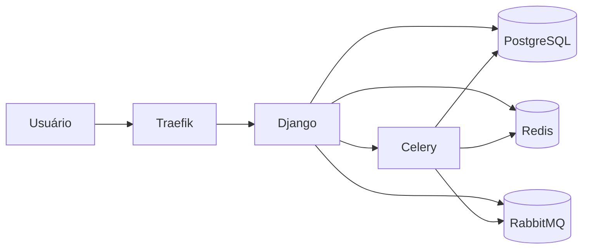

# Arquitetura

O SCSI é um monólito Django multi-tenant compartilhado. Todas as entidades de negócio herdam ou se relacionam com `Brokerage` e usam filtros explícitos por corretora.

Apps principais ficam na raiz do projeto, com `core` para URLs/settings, `base` para mixins e managers, e apps de domínio para CRUDs.
